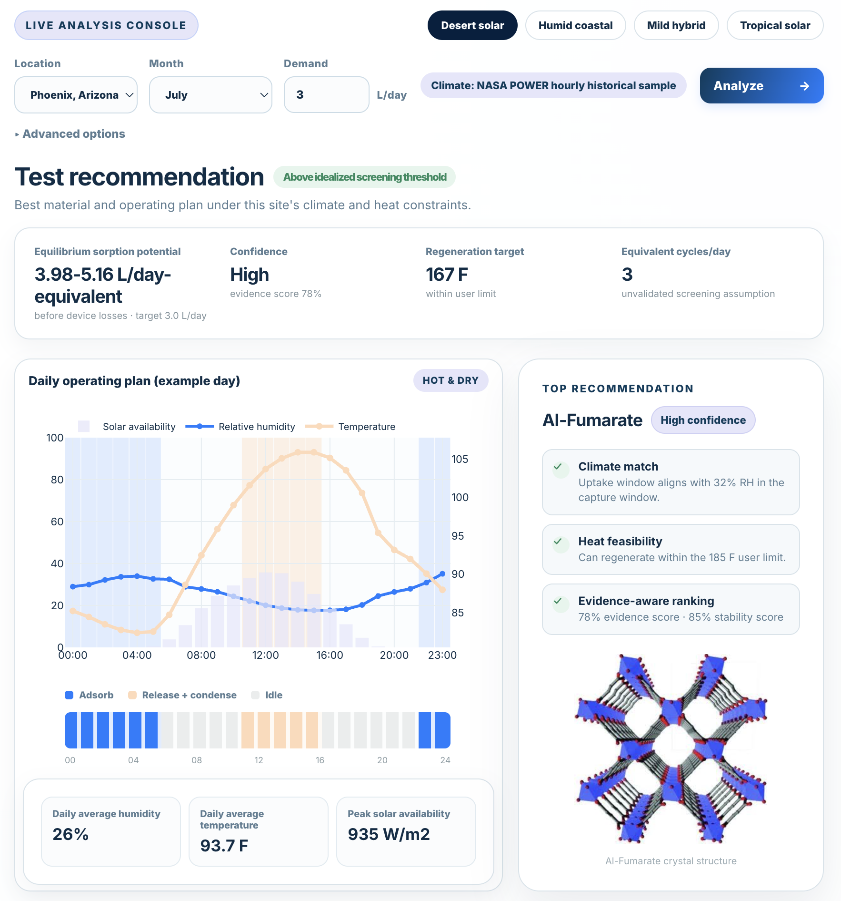
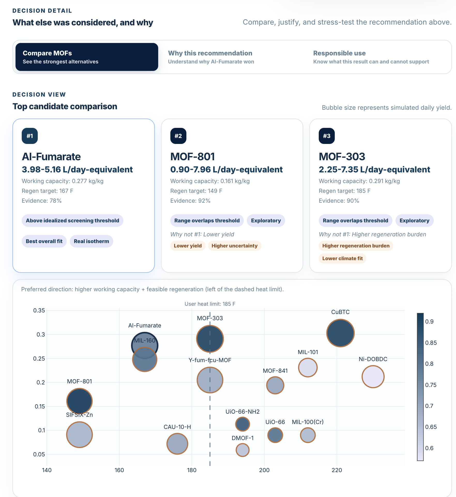
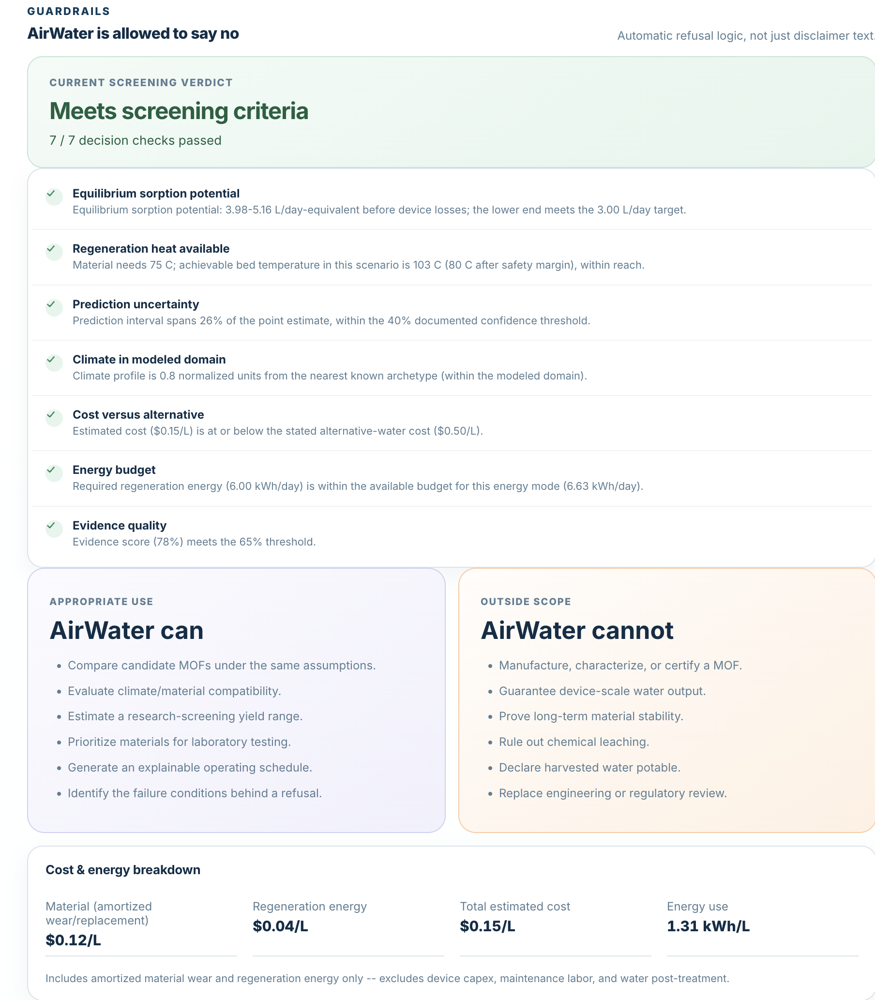

# AirWater AI

AirWater AI is a functional proof-of-concept application for climate-aware selection of metal-organic frameworks (MOFs) for atmospheric water harvesting, ranking candidates on **real experimental water-adsorption data** from the NIST Isotherm Database (ISODB) rather than synthetic curves.

The browser interface accepts a location, season, MOF mass, water target, energy source, regeneration-temperature limit, and device-efficiency assumption. The Python model API then:

1. Builds a 24-hour climate profile.
2. Predicts water uptake for each candidate MOF.
3. Estimates working capacity and simulated daily water yield.
4. Ranks candidates using yield, climate fit, regeneration feasibility, evidence, stability, and cost proxies.
5. Generates capture and release windows.
6. Runs a refusal gate that can say **do not deploy** when the yield, uncertainty, or climate-domain checks fail — not just a disclaimer.
7. Returns explanations, confidence labels, model metrics, and responsible-use warnings.

## Live demo

https://airwater-ai.onrender.com/

## Important scope statement

AirWater AI is a research-screening application. It does not manufacture, characterize, certify, or guarantee a MOF or a water-harvesting device. It does not declare harvested water potable. All output requires laboratory, engineering, safety, and water-quality validation.

## Screenshots

**Analysis console** — pick a location and target, then get a top recommendation with confidence, evidence score, and a 24-hour capture/release schedule.



**Candidate comparison** — every candidate MOF ranked side by side, with an explicit "why not #1" reason for each runner-up.



**Refusal gate** — every decision check shown individually, plus what the app can and cannot claim.



## Quick start

### 1. Install Python dependencies

```bash
python -m pip install -r requirements.txt
```

### 2. Start the application

```bash
python app.py
```

The application opens at:

```text
http://127.0.0.1:8000
```

Alternative launchers:

- macOS/Linux: `./run_demo.sh`
- Windows: `run_demo.bat`

To prevent the browser from opening automatically:

```bash
python app.py --no-browser
```

To use another port:

```bash
python app.py --port 8080
```

## Architecture

```text
Browser UI (HTML, CSS, JavaScript, local Plotly)
                 |
                 | POST /api/analyze
                 v
Python standard-library HTTP server
                 |
       Climate profile generator
                 |
    Water-uptake prediction model
                 |
 Ranking and schedule optimization logic
                 |
        Refusal / decision gate
                 |
  JSON recommendation and evidence response
```

### Data pipeline (offline, run once to rebuild the dataset)

```text
1. scripts/fetch_nist_isodb.py     Pull raw water isotherms from NIST ISODB for a curated MOF list
2. scripts/build_water_isotherms.py Normalize raw isotherms into one point-level table (unit conversion, RH derivation)
3. scripts/build_candidate_mofs.py  Fit an uptake curve per material, score evidence quality, assign tiers A/B/C
4. scripts/train_demo_model.py      Train the RandomForest on real Tier A/B points, validate leave-one-MOF-out
```

Current dataset: 15 candidate MOFs (8 Tier A, 4 Tier B, 3 Tier C exploratory), built from 1,226 real measurement points across 12 materials and 13 published papers. See `data/provenance_manifest.json` for the full per-material audit trail.

## Folder structure

```text
airwater_app/
  app.py                         Main launcher
  server.py                      Local API and static-file server
  requirements.txt               Python dependencies
  run_demo.sh                    macOS/Linux launcher
  run_demo.bat                   Windows launcher
  web/
    index.html                   Browser application
    styles.css                   Responsive visual design
    app.js                       UI behavior and charts
    materials/                   Per-material crystal-structure images
    vendor/plotly.min.js         Local charting library
  airwater/
    climate.py                   Demo and optional NASA climate data
    selector.py                  Prediction, ranking, and scheduling
    decision.py                  Refusal/decision gate logic
    physics.py                   Shared physical/economic assumptions (documented, not experimentally calibrated)
    model_artifacts/             Trained model, metrics, and training rows (real + legacy synthetic reference)
  data/
    candidate_mofs.csv           15 candidates: Tier A/B fit from real isotherms, Tier C exploratory placeholders
    water_isotherms.csv          1,226 normalized real measurement points (NIST ISODB)
    provenance_manifest.json     Per-material data-provenance and evidence audit trail
    demo_climate_profiles.csv    Offline fallback climate data
    raw/                         Raw fetched NIST ISODB JSON (checked in for provenance; regenerate via fetch_nist_isodb.py)
  scripts/
    fetch_nist_isodb.py          ETL step 1: fetch raw isotherms
    build_water_isotherms.py     ETL step 2: normalize into one table
    build_candidate_mofs.py      ETL step 3: fit + score + tier each material
    train_demo_model.py          ETL step 4: train and validate the uptake model
    smoke_test.py                Test all application presets
    ai_spec_test.py              Ad hoc single-scenario response check
  docs/
    competition_submission.md    Draft project description
    demo_script.md               Five-minute walkthrough
    judge_demo_checklist.md      Pre-presentation checklist
    source_attribution.md        Research and data references
    model_results_card.html      Held-out accuracy vs. baseline, by evidence tier
    screenshot_analysis.png      Analysis console screenshot
    screenshot_compare.png       Candidate comparison screenshot
    screenshot_guardrails.png    Refusal-gate screenshot
    ui_preview.png               Interface preview
```

## Model and data limitations

The packaged RandomForest model is trained on real NIST ISODB water-adsorption isotherms (1,226 points, 12 materials, 13 papers), validated with leave-one-MOF-out cross-validation — for every material, it is held out completely and predicted from the other eleven. Held-out MAE is 0.119 kg/kg and R² is 0.24, a modest but real signal for a screening tool, not a certified predictor. Performance varies by tier: Tier A materials (clean fits) reach R² ≈ 0.51; Tier B (quality-flagged fits, only 4 materials) currently performs worse than a naive mean-of-other-MOFs baseline, which the app does not hide.

Known gaps, honestly stated:

- **Tier C materials** (MOF-303, MOF-801, MOF-841) have no NIST ISODB water isotherm at all and keep their original synthetic prototype descriptors — they are excluded from model training and are always exploratory.
- Only **point holdout** (random 20% of points within a material's own isotherm) and **MOF holdout** (leave-one-MOF-out) are implemented. **Condition holdout** (hiding an RH or temperature band) and **source-paper holdout** are not yet built.
- Regeneration temperature, cycle time, water-stability score, cost score, pore volume, and surface area are **not derivable from adsorption isotherms** and remain literature-informed estimates pending citation for several materials.
- The device model does not yet cover heat transfer, airflow, condenser performance, degradation, fouling, or water-quality risk in detail.

## Optional pipeline rebuild

Only needed if the curated MOF list or raw NIST data changes; the checked-in `data/*.csv` and `airwater/model_artifacts/` are already built from these steps.

```bash
python scripts/fetch_nist_isodb.py
python scripts/build_water_isotherms.py
python scripts/build_candidate_mofs.py
python scripts/train_demo_model.py
```

## Smoke test

```bash
python scripts/smoke_test.py
```

The smoke test runs all four UI presets and checks the response contract, ranking, schedule, and model metadata.
